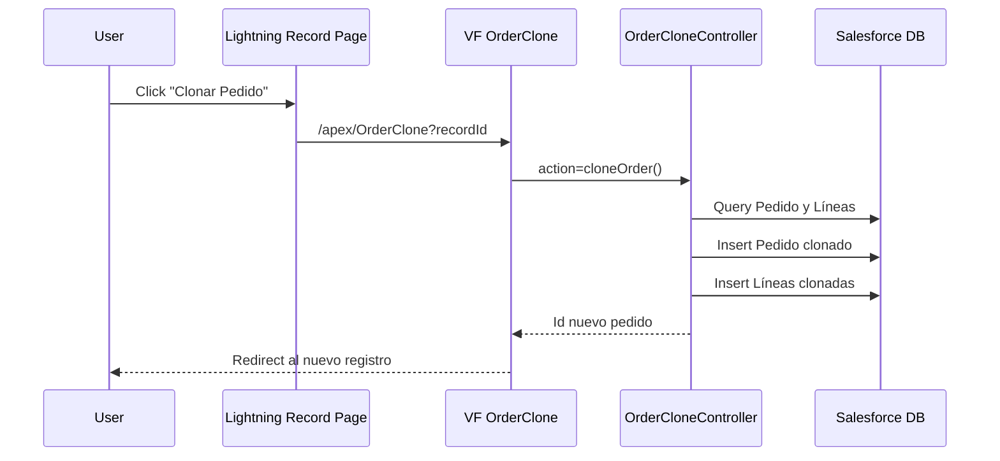

# Clona Pedido – Guía Técnica

## Arquitectura


## Puntos clave
- Botón WebLink en `Order__c` abre VF `OrderClone` con `recordId`.
- `OrderCloneController.cloneOrder(String originalOrderId)`:
  - Verifica `isCreateable()` sobre `Order__c`.
  - `WITH SECURITY_ENFORCED` en SOQL.
  - Clona cabecera con `clone(false, true, false, false)`.
  - Normaliza campos: `OrderNumber__c=null`, `OrderDate__c=Date.today()`, `Status__c='Nuevo'`, limpia `A3Status__c`, `PlantStatus__c`, `DeliveryNoteNumber__c`, `InvoiceNumber__c`, `FreightDate__c`.
  - Inserta el pedido clonado y clona líneas.
- `cloneOrderLines(originalOrderId, clonedOrderId)`:
  - Selecciona `OrderItem__c` por `Pedido__c`.
  - Clona cada línea y reasigna `Pedido__c=clonedOrderId`.
  - Inserta en bloque.

## Referencias de código
- WebLink en `Order__c`:
```2064:2073:force-app/main/default/objects/Order__c.object
        <fullName>Clonar_Pedido</fullName>
        <displayType>button</displayType>
        <url>/apex/OrderClone?recordId={!Order__c.Id}</url>
```
- Visualforce:
```1:6:force-app/main/default/pages/OrderClone.page
<apex:page controller="OrderCloneController" action="{!cloneOrder}">
    <apex:pageMessages />
```
- Apex Controller (resumen):
```35:54:force-app/main/default/classes/OrderCloneController.cls
Order__c clonedOrder = originalOrder.clone(false, true, false, false);
clonedOrder.OrderNumber__c = null;
clonedOrder.OrderDate__c = Date.today();
clonedOrder.Status__c = 'Nuevo';
insert clonedOrder;
cloneOrderLines(originalOrderId, clonedOrder.Id);
```
- Clonado de líneas:
```76:99:force-app/main/default/classes/OrderCloneController.cls
List<OrderItem__c> originalLines = [ ... WHERE Pedido__c = :originalOrderId ... ];
for (OrderItem__c originalLine : originalLines) {
    OrderItem__c clonedLine = originalLine.clone(false, true, false, false);
    clonedLine.Pedido__c = clonedOrderId;
}
insert clonedLines;
```

## Variantes
- LWC `orderCloneAction`/`orderCloneButton` llaman a `OrderCloneController.cloneOrder`.
- Quick Action `orderCloneQuickAction` usa `OrderCloneQuickActionController` (para objeto estándar `Order`).
- Servicio `OrderCustomCloneService`: clonado seguro con detección de campos (multidivisa).

## Despliegue
- Ver `DEPLOYMENT.md`, `deploy/package.xml`.

## Pruebas
- Ver `TEST_PLAN.md`.

## Rollback
- Ver `ROLLBACK.md`.
